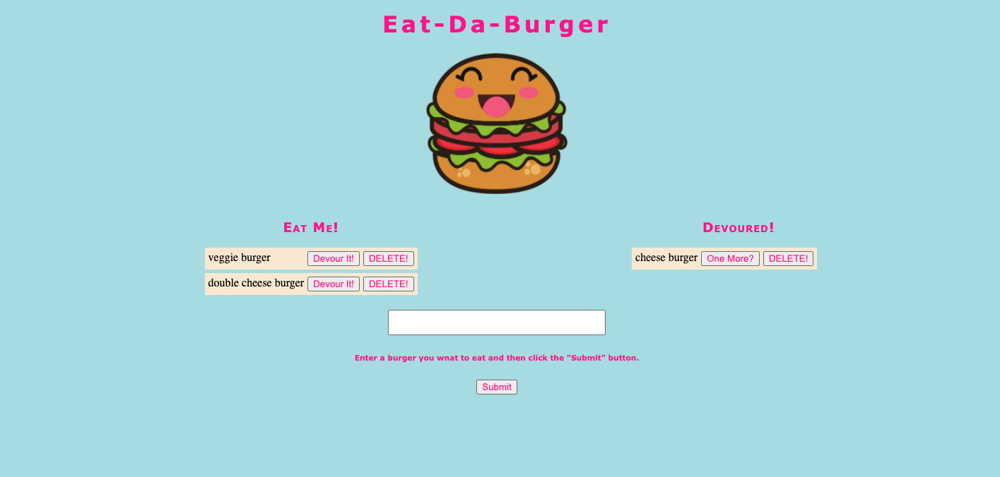

# BurgersApp

[View App](https://burger-at.herokuapp.com)

## Description

This app allows users to add any type of burger they choose to eat. They have the option to eat the burger or delete the burger. The eaten burger will be added to a new list. From the eaten list, the burgers can be added back to the uneaten list or they can be deleted. The burgers are saved to the MySQL database. Whether they have been eaten or not are stored using a boolean.

## Table of Contents

* [Process](#process)
* [Installation](#installation)
* [Questions](#questions)

## Process

1. Installed all the packages necessary for this applciation

2. Created all the directories and files needed for this application

3. Created PORT and PORT listener, routes,a nd required express in server.js file.

4. Created db directory with
    * schema.sql - used to create the database and table
    * seeds.sql - used to prepopulate table with dummy-data

5. Created connection from Node to MySQL.

6. Imported MySQL connection to orm.js and created helper functions for SQL syntax

7. Create objects for all the SQL statement functions and exported the orm object model for burger.js in models directory

8. In the models directory under burger.js

    * The ORM to create functions that will interact with the database was imported and called the functions were called

    * Exported the database functions for the controller

9. Imported express and burger.js from models directory to burgerController.js

## Installation

The command that should be run to install dependencies is: 
`npm i` and `npm start`

## Questions

If you have any further questions regarding this project, please feel free to contact.

GitHub Username: ashvinit
Email Address: ashvinithomas@gmail.com

